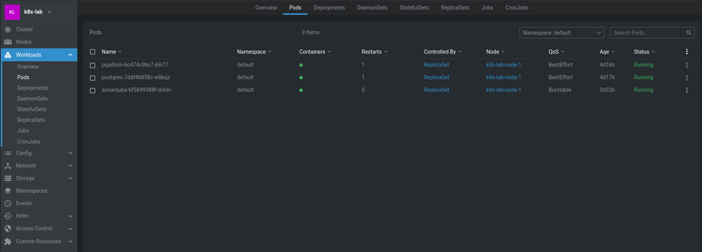
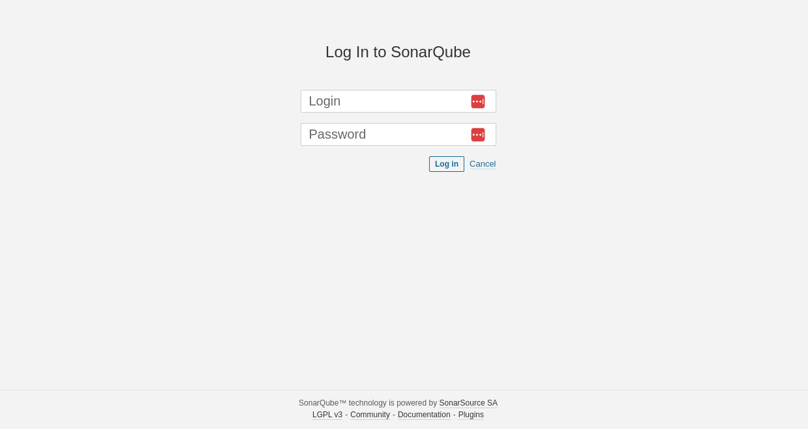
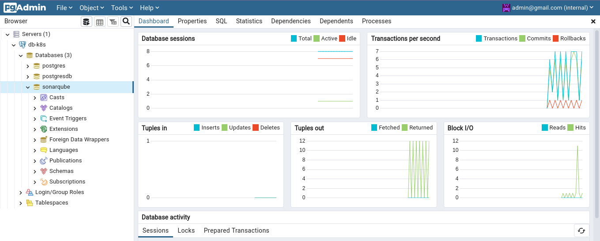
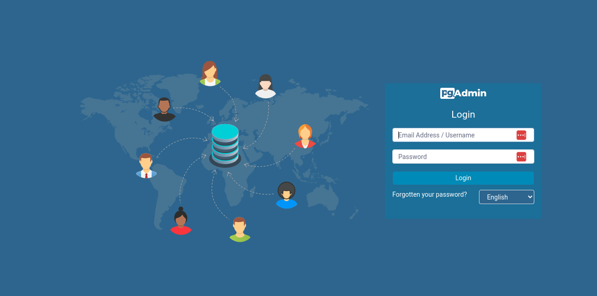

## Project

- Deployment Services Kubernetes
    - Sonar
    - Postgresql
    - PgAdmin
    - Haproxy Ingress

- Configuração de Balanceador Externo

## Etapas
0. [Subir um balanceador dockerizado localmente.](/balanceador/Readme.md) 
1. [Helm Chart Sonarqube.](/helmchart/sonar/Readme.md)
2. [Deployment Sonarqube.](/workload/sonarqube/Readme.md)

## Serviços

<h1 align="center">K8s Sonar Postgresql</h1>

  

<h1 align="center">Sonar</h1>

  

<h1 align="center">Postgresql</h1>

  

<h1 align="center">PgAdmin</h1>

  

