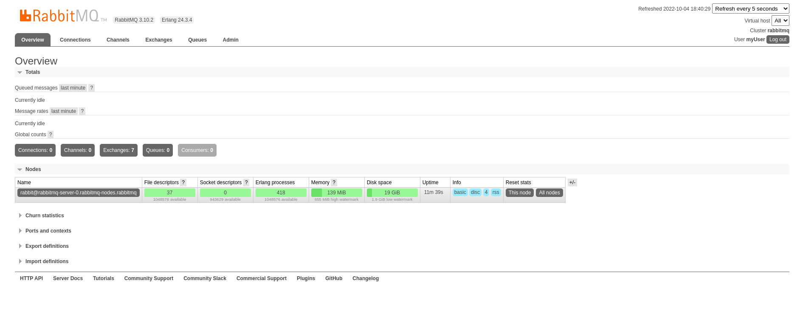

<h1 align="center">K8s RabbitMQ Operator</h1>

<p align="center">
  
</p>


## Rabbitmq
- Instalando o RabbitMQ Cluster Operator em um Cluster Kubernetes

## Instalando o RabbitMQ Cluster Operator

- Instalando o operador:

```bash
kubectl apply -f "https://github.com/rabbitmq/cluster-operator/releases/latest/download/cluster-operator.yml" 
```

- Deployando o RabbitMQ
```bash
kubectl apply -f rabbitmq.yaml
```

- Criando conta de usuário
```bash
kubectl exec -n rabbitmq rabbitmq-server-0 -it -- rabbitmqctl add_user myUser myPass
```

- Tornando usuário administrador
```bash
kubectl exec -n rabbitmq rabbitmq-server-0 -it -- rabbitmqctl set_user_tags myUser administrator
```

- Dando permissão em tudo
```bash
kubectl exec -n rabbitmq rabbitmq-server-0 -it -- rabbitmqctl set_permissions -p / myUser ". " ". " ".*"
```

- OBS: No laboratório foi criado um `PersistentVolume manualmente` o que não é uma abordagem recomendada. O ideal seria configurar um provisionamento dinâmico o que permitirá que gere um `PersistentVolume` automaticamente.

- `yaml` do PersistentVolume
```yaml
apiVersion: v1
kind: PersistentVolume
metadata:
  name: pv-rabbitmq
spec:
  capacity:
    storage: 10Gi
  volumeMode: Filesystem
  accessModes:
  - ReadWriteOnce
  persistentVolumeReclaimPolicy: Delete
  local:
    path: /mnt/rabbitmq
  nodeAffinity:
    required:
      nodeSelectorTerms:
      - matchExpressions:
        - key: kubernetes.io/hostname
          operator: In
          values:
          - k8s-lab-node-1
```

- Deverá ser criado o diterório `/mnt/rabbitmq` no nó escolhido onde o `rabbitmq` irá subir, no exemplo foi o `k8s-lab-node-1`, que é um dos nodes do cluster kubernetes.

<p align="center">
  
</p>

## Referências

- https://www.rabbitmq.com/kubernetes/operator/install-operator.html
- https://kubernetes.io/docs/tasks/configure-pod-container/assign-pods-nodes-using-node-affinity/
- https://stackoverflow.com/questions/66171565/rabbitmq-cluster-operator-does-not-work-in-kubernetes
- https://kubernetes.io/docs/concepts/storage/dynamic-provisioning/
- https://github.com/danieleghione/Rabbitmq